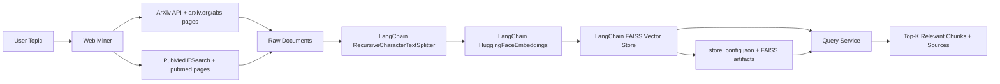
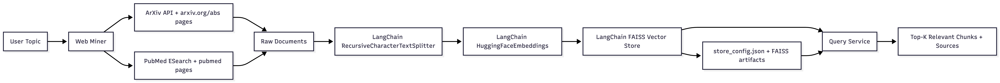
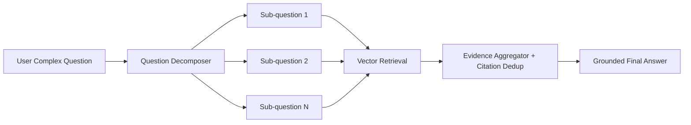
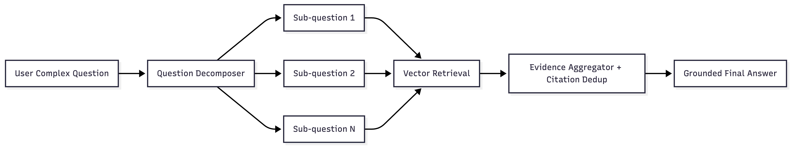

# AI-Powered Scientific Search Engine (NLP RAG Baseline)

This project builds a small but functional pipeline that:

1. Mines scientific web pages from **ArXiv** and **PubMed**
2. Extracts textual content (title + abstract)
3. Splits text into meaningful chunks (LangChain splitter)
4. Creates embeddings for chunks (LangChain HuggingFace embeddings)
5. Stores vectors in a local FAISS index (LangChain vector store)

## System Design





## Complex Question Flow

For multi-part questions, the API runs a retrieval-composition flow:





The `/answer` endpoint returns:

- `sub_questions`: the decomposition output
- `steps`: retrieval results for each sub-question
- `answer`: composed, evidence-grounded synthesis
- `citations`: de-duplicated evidence references

## Why this design

- **Simple and robust**: Uses standard HTTP endpoints + HTML parsing.
- **Meaningful splitting**: LangChain `RecursiveCharacterTextSplitter` preserves context better than naive fixed slicing.
- **Fast retrieval**: LangChain FAISS vector store provides efficient local retrieval.
- **Traceability**: Each result includes source URL and document metadata.

## Project Structure

- `AI-Powered-Scientific-Search-Engine/app/miner.py`: ArXiv/PubMed page mining
- `AI-Powered-Scientific-Search-Engine/app/chunking.py`: LangChain text splitting
- `AI-Powered-Scientific-Search-Engine/app/vector_store.py`: LangChain embeddings + FAISS persistence + search
- `AI-Powered-Scientific-Search-Engine/app/api.py`: FastAPI service (`/health`, `/ready`, `/build-index`, `/query`, `/answer`)
- `AI-Powered-Scientific-Search-Engine/main.py`: ASGI app entrypoint for `uvicorn`
- `AI-Powered-Scientific-Search-Engine/tests/test_api.py`: API tests with FastAPI `TestClient`

## Setup

```bash
cd AI-Powered-Scientific-Search-Engine
uv sync
```

Configuration:

1. Copy defaults:

```bash
cp .env.example .env
```

2. Edit `.env` to adjust:

- `SCISEARCH_VECTOR_STORE_DIR` (index location)
- `EMBEDDING_MODEL_NAME` (embedding backend)
- `LOG_LEVEL`
- `LANGFUSE_*` tracing settings

## Run the API

Default (`uv`):

```bash
uv run uvicorn main:app --reload --port 8000
```

Alternative (direct Python):

```bash
source .venv/bin/activate
python -m uvicorn main:app --reload --port 8000
```

## Production Hardening Included

- Structured JSON logs with request metadata (`request_id`, `path`, `status_code`, latency)
- Request ID middleware with `x-request-id` propagation
- Standardized error envelope for HTTP/validation/internal failures
- Readiness endpoint (`/ready`) in addition to liveness (`/health`)
- Centralized typed settings loaded from `.env`
- Configurable embedding model and vector store path
- Optional Langfuse trace emission for `/build-index`, `/query`, `/answer`

Example log line:

```json
{"asctime":"2026-02-16 05:45:12,004","levelname":"INFO","name":"app.api","message":"request.completed","request_id":"f9ad...","path":"/answer","method":"POST","status_code":200,"duration_ms":128.43}
```

## Prototype E2E Run (Endpoint-Only)

Focused domain for the prototype:

- `large language models for biology`

This run uses ArXiv full PDFs (5-10 papers recommended), builds the index, and runs retrieval queries entirely via API endpoints.

1. Start the API.

Default (`uv`):

```bash
uv run uvicorn main:app --reload --port 8000
```

Alternative (direct Python):

```bash
source .venv/bin/activate
python -m uvicorn main:app --reload --port 8000
```

2. Build the index from ArXiv (full PDFs).

Note: `SCISEARCH_VECTOR_STORE_DIR` is created automatically when `/build-index` runs.

```bash
curl -X POST http://127.0.0.1:8000/build-index \
  -H "Content-Type: application/json" \
  -d '{
    "topic": "large language models for biology",
    "arxiv_docs": 8,
    "pubmed_docs": 0,
    "chunk_size": 1200,
    "chunk_overlap": 1
  }'
```

3. Query the built index.

```bash
curl -X POST http://127.0.0.1:8000/query \
  -H "Content-Type: application/json" \
  -d '{
    "query": "How are LLMs used for biological sequence modeling?",
    "top_k": 5
  }'
```

The `/build-index` response includes:

- Exact papers indexed (arXiv ID + title + PDF URL + local path)
- Index/chunk counts and output directory

## Build an Index (HTTP)

Note: You do not need to pre-create `SCISEARCH_VECTOR_STORE_DIR` (default `data/vector_store`). The API creates it during `/build-index`.

```bash
curl -X POST http://127.0.0.1:8000/build-index \
  -H "Content-Type: application/json" \
  -d '{
    "topic": "large language models for drug discovery",
    "arxiv_docs": 8,
    "pubmed_docs": 0,
    "chunk_size": 550,
    "chunk_overlap": 1
  }'
```

Output:

- `data/vector_store/index.faiss`
- `data/vector_store/index.pkl`
- `data/vector_store/store_config.json`

## Query the Index (HTTP)

```bash
curl -X POST http://127.0.0.1:8000/query \
  -H "Content-Type: application/json" \
  -d '{
    "query": "Which papers discuss LLM-based molecule generation?",
    "top_k": 5
  }'
```

## Ask Complex Questions (HTTP)

```bash
curl -X POST http://127.0.0.1:8000/answer \
  -H "Content-Type: application/json" \
  -d '{
    "question": "What are the dangerous medical conditions and what risk factors are mentioned?",
    "max_substeps": 4,
    "top_k_per_step": 3
  }'
```

## Evaluate Answer Quality (HTTP)

Use `/evaluate` with labeled references to measure answer quality directly.

```bash
curl -X POST http://127.0.0.1:8000/evaluate \
  -H "Content-Type: application/json" \
  -d '{
    "question": "What are dangerous medical conditions and risk factors?",
    "reference_answer": "Sepsis and hypertensive crisis are high-risk conditions. Delayed diagnosis is a major risk factor.",
    "required_facts": [
      "sepsis is a dangerous condition",
      "delayed diagnosis is a risk factor"
    ],
    "expected_doc_ids": ["1234.5678"]
  }'
```

Scoring dimensions returned:

- `correctness_score`: semantic match to reference answer
- `faithfulness_score`: how well answer statements are supported by retrieved evidence
- `fact_coverage_score`: required fact coverage ratio
- `citation_recall_score`: expected source coverage in cited doc IDs
- `overall_score`: weighted aggregate of the above metrics

Evaluation logic details:

1. The system generates an answer using the same production flow:
   - question decomposition
   - per-subquestion retrieval
   - evidence-grounded composition
2. It then computes four quality signals:
   - `correctness_score`: embedding similarity between generated answer and `reference_answer`
   - `fact_coverage_score`: fraction of `required_facts` semantically matched in answer sentences
   - `faithfulness_score`: fraction of factual answer sentences supported by retrieved evidence sentences
   - `citation_recall_score`: overlap between `expected_doc_ids` and cited document IDs
3. Final score formula:

```text
overall_score =
  0.35 * correctness_score +
  0.30 * fact_coverage_score +
  0.20 * faithfulness_score +
  0.15 * citation_recall_score
```

Metric ranges:

- All scores are normalized to `[0, 1]`
- Higher is better
- `missing_facts` and `unsupported_sentences` provide actionable error analysis

## Health and Readiness

```bash
curl http://127.0.0.1:8000/health
curl http://127.0.0.1:8000/ready
```

## Docker

Build and run app only:

```bash
docker compose up --build
```

Auto-restart app container when code changes:

```bash
docker compose up --build --watch
```

Run app + Langfuse observability stack:

```bash
docker compose --profile observability up --build
```

If you change ClickHouse credentials after first startup, reset the observability volumes:

```bash
docker compose --profile observability down -v
docker compose --profile observability up --build
```

When Langfuse is running:

- Langfuse UI: `http://127.0.0.1:3000`
- Set `LANGFUSE_ENABLED=true` in `.env`
- Fill `LANGFUSE_PUBLIC_KEY` and `LANGFUSE_SECRET_KEY` with keys from your Langfuse project

## Test (FastAPI)

Default (`uv`):

```bash
uv run pytest -q
```

Alternative (direct Python):

```bash
source .venv/bin/activate
python -m pytest -q
```

## Tradeoffs and Notes

- This baseline now indexes **ArXiv full PDFs** (for ArXiv docs) and PubMed abstracts (if enabled).
  - Pro: better coverage of methods/details for retrieval.
  - Con: larger documents increase embedding/indexing time.
- HTML selectors can change over time; production code should include parser tests and fallback extraction.
- For larger corpora, move metadata from JSON to SQLite/Postgres and use a scalable vector DB.
- Re-ranking (cross-encoder) can improve precision but adds latency and complexity.

## Additional Production Checklist

See `PRODUCTION_CHECKLIST.md` for implemented hardening items and recommended next steps.
